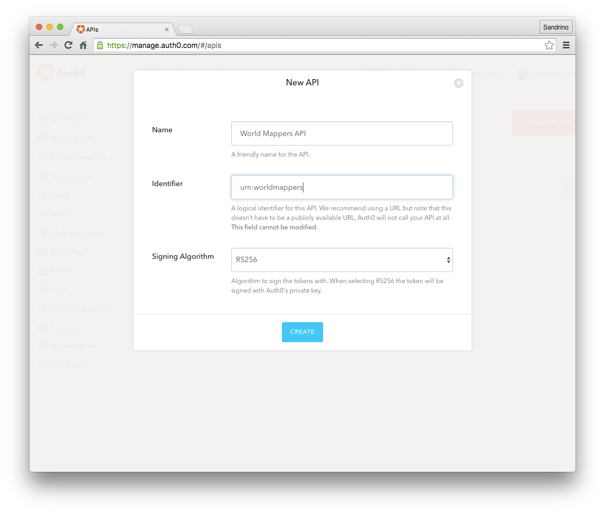
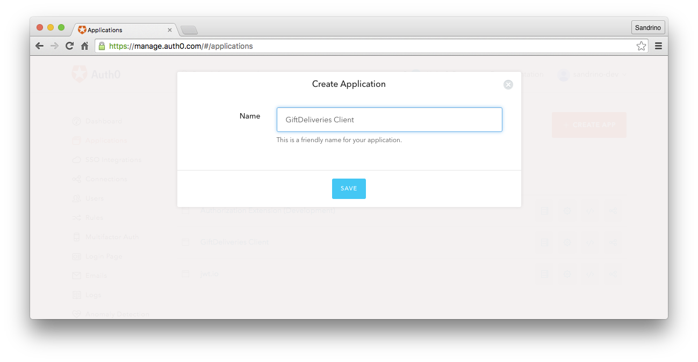
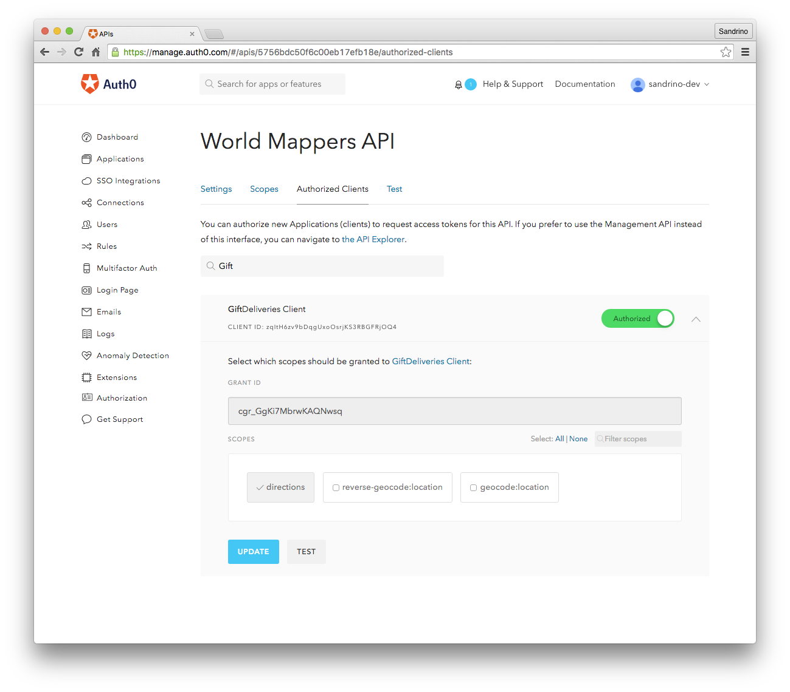

# Auth0 API Authorization - Machine to Machine

These samples show how to setup machine to machine flows using the OAuth2 `client_credentials` flow in Auth0 ([more information](https://auth0.com/docs/api-auth)).

In this flow you'll have:

 - An Authorization Server (Auth0)
 - A Resource Server (your API, in this example the **World Mappers API**)
 - One or more Clients (a consumer of the API, in this example **Gift Deliveries**)

## World Mappers API

The team at World Mappers first registered their API [as a Resource Server in Auth0](https://manage.auth0.com/#/apis):



After creating the RS they also specified the scopes (permissions) available in this Resource Server:


A client calling this API could be granted any of these scopes.

The [worldmappers-api-nodejs](./worldmappers-api-nodejs) sample shows how you would configure your API to be a Resource Server. This is pretty straightforward: you accept tokens issued by the Authorization Server (`iss: https://YOUR_DOMAIN/`) to a Resource Server (`aud: urn:worldmappers`).

By default these tokens will be signed using RS256 so your API will need some logic to retrieve that public key (from: `https://YOUR_DOMAIN/.well-known/jwks.json`).

And finally your code needs some logic that inspects the contents of the token and validates that the client has the right scope to call a given endpoint:

```js
app.get('/api/location/geocode', requireScope('geocode:location'), function(req, res, next) {
  res.json({
    lat: 47.6178819,
    lng: -122.194041
  });
});
```

## Gift Deliveries Client

After setting up the Resource Server you can register the client for Gift Deliveries.



By default a Client is not authorized to access any of the Resource Servers. Which is why the next step is to authorize the client for the Resource Server and define which scopes are enabled for this client.



Finally the client can call the `https://YOUR_DOMAIN/oauth/token` endpoint to get an access token which can then be used to call the World Mappers API (RS).

```js
var options = {
  method: 'POST',
  url: 'https://' + env('AUTH0_DOMAIN') + '/oauth/token',
  headers: {
    'content-type': 'application/json'
  },
  body: {
    audience: env('RESOURCE_SERVER'),
    grant_type: 'client_credentials',
    client_id: env('AUTH0_CLIENT_ID'),
    client_secret: env('AUTH0_CLIENT_SECRET')
  },
  json: true
};

request(options, function(err, res, body) {
  if (err || res.statusCode < 200 || res.statusCode >= 300) {
    return callback(res && res.body || err);
  }

  callback(null, body.access_token);
});
```

## Running the Node.js samples

Before running the Node.js samples make sure you update the `config.json` file in both projects with your own account information.


